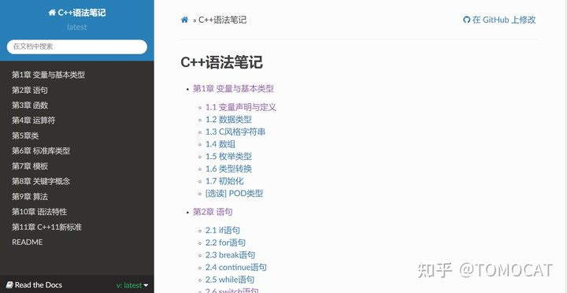

# 新增图片

网络图片转本地



截图转本地


# 功能测试

## 代码

```bash
sudo apt-get install vim
```

### 表格

| 1    | 2    | 3    |
| ---- | ---- | ---- |
| 4    | 5    | 6    |
| 7    | 8    | 9    |
| 10   | 11   | 12   |

#### 高亮

1. > 啊啊
   >
   > *啊啊*
   >
   > **ad**
   >
   > 啊

2. 啊

3. 哦

4. 饿

- aaa
- bbb
- ccc

- [ ] undone
- [x] done

​	缩进

123456789

​	1234567